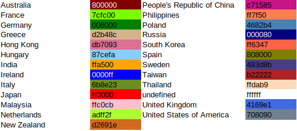

# diggrdata_FromSoftware

This repository features several datasets about videogames developed and or published by the Japanese company FromSoftware. The data is used in my ongoing research project on videogame spatialization, and will be updated and extended over time. For stable versions used in my research, please refer to the Zenodo upload specified in the respective research output.

Large portions of the data have been aggregated with the [diggr tools](https://github.com/diggr/) and edited manually thereafter. This research has received support from the DFG.

This readme provides an overview of the data included in this dataset.
The data includes the following items:
1. FromSoftware Datatable
2. FromSoftware Production Network based on Mobygames Release Data
3. FromSoftware Release Timeline
4. Various visualizations and charts created from the data.

## 1. FromSoftware Datatable

### current version from

2021-01-05

### filename

data/FromSoftware_Tulpa_DataTable_edited20210105.csv

### content summary

This file contains data found on Mobygames.com, Wikidata and GameFAQs for a manually curated set of videogame titles including all known games developed by the Japanese developer and publisher FromSoftware. The data includes
- the number of releases per release region 
- the number of companies per country involved in the production
- identifier data for Mobygames.com

The original data was created based on our curated dataset  with [diggr tulpa](https://github.com/diggr/tulpa). It was then edited to include an all-english game title version, as well as some aggregate information. The column names were changed in some cases to be more self-explanatory.

### column description

title
- title of the game according to our curated list

edited title	
- title in roman letters only, for convenience reasons

first_release_year
- year of the first release of a game, used for sorting

xx_releases (multiple columns)
- number of releases for several release regions, including 
  - AS (Asia)
  - AU (Australia)
  - EU (Europe)
  - JP (Japan)
  - KO (Korea)
  - US (North America).

n_releases
- number of releases in total

columns named after countries (multiple columns)
- number of companies contributing to a game having their headquarters in the respective country according to Wikidata
  
Non-Japan based companies
- aggregate of companies with headquarters outside of Japan

n_companies	
- total number of companies

platforms	
- all platforms a game has been published for

unknown
- number of companies involved with unknown headquarter location

moby_id	
- id of the mobygames data on a game

moby_slug	
- slug of the mobygames data on a game

moby_title
- title used on mobygames for a game

## 2. FromSoftware Production Network based on Mobygames Release Data

### current version from

2020-10-05

### filenames

data/FromSoftware_ProductionNetwork_MobygamesReleaseBased20201005_nodes.csv

data/FromSoftware_ProductionNetwork_MobygamesReleaseBased20201005_edges.csv

### content summary

Production network of companies involved in FromSoftware games according to the release data on Mobygames.com. Edges are based on contribution to the same game (collaboration network), including a distinction of node for different roles a company might take on, as well as the company location if available via Wikidata. The data was created with [diggr lemongrab](https://github.com/diggr/lemongrab) and edited manually in Gephi 0.9.2 to add statistical data, as well as to include several country data missing on Wikidata and a country based color hex code, following this color schema:

## 3. FromSoftware Release Timeline

### current version from

2020-07-18

### filenames

visualizations/fromsoft_release_release_timeline.html

visualizations/fromsoft_release_release_timeline.html.prov

### content summary

All available FromSoftware game releases in Japan (JP), Europe (EU) and North America (US) mapped on an interactive timeline with some additional information. The visualization was created with [diggr tulpa](https://github.com/diggr/tulpa). Provenance information is available, added with [diggr provit](https://github.com/diggr/provit).

## 4. Various visualizations and charts created from the data between October 2020 and December 2020

1. [Headquarter Locations of Companies involved in FromSoftware games](visualizations/FromSoftware_ReleaseAnalysis_CompanyLocations.svg)
2. [Distribution of first releases by region](visualizations/FromSoftware_ReleaseAnalysis_FirstReleaseCountryDistribution.svg)
3. [Temporal Distance between first release in Japan and first release in the US and EU region](visualizations/FromSoftware_ReleaseAnalysis_ReleaseDistanceJPEUUS.svg)
4. [Per-game releases per region, stacked](visualizations/FromSoftware_ReleaseAnalysis_ReleaseRegion.svg)
5. [Role-based chart of company locations, divided into two groups, a.) Japan, b.) other countries](visualizations/FromSoftware_Rolebased_companyCountries.svg)
6. [FromSoftware Production Network visualized with Gephi based on the FromSoftware Production Network dataset, including all roles](visualizations/FromSoftware_ProductionNetwork_withroles_all.svg)
7. [FromSoftware Production Network visualized with Gephi based on the FromSoftware Production Network dataset, excluding roles pertaining to localization, distribution and local publishing](visualizations/FromSoftware_ProductionNetwork_withroles_nopubldistrloc.svg)

# ARCHIVE (original data, etc.)

## Original FromSoftware Production Network based on Mobygames Release Data

### current version from

2020-03-27

### filenames

archive/company_network_FromSoftware.graphml

archive/company_network_FromSoftware.graphml.prov

### content summary

Original network data created with [diggr lemongrab](https://github.com/diggr/lemongrab) before further editing. Provenance information is available, added with [diggr provit](https://github.com/diggr/provit).

# Meta

**License**
[CC-BY 4.0](http://creativecommons.org/licenses/by/4.0)

**Copyright**
2021 Martin Roth [research@asobiba.de](mailto: research@asobiba.de)
