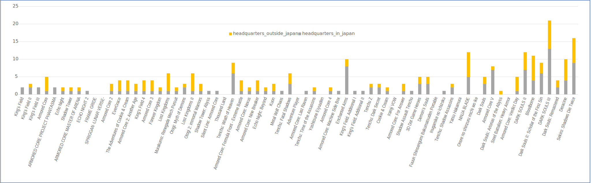
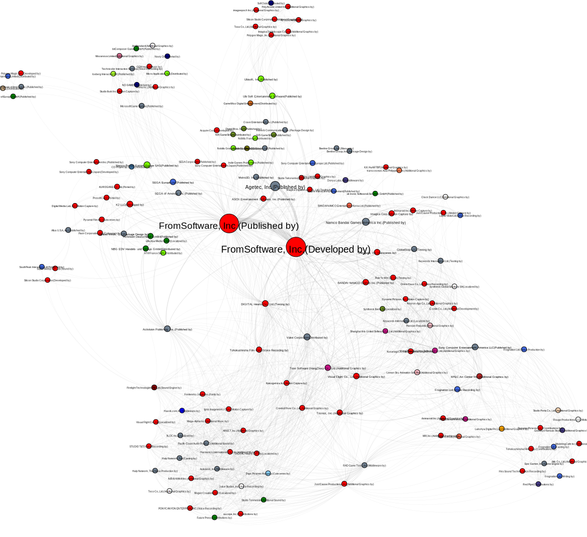
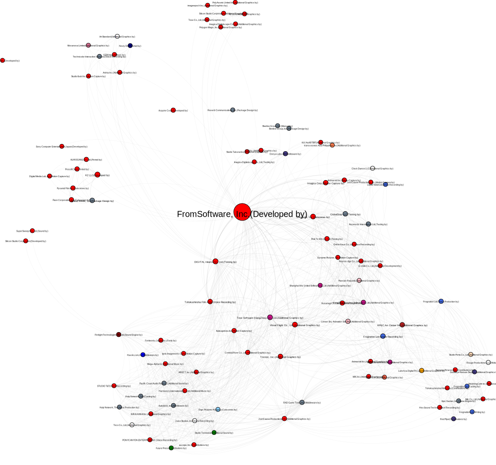
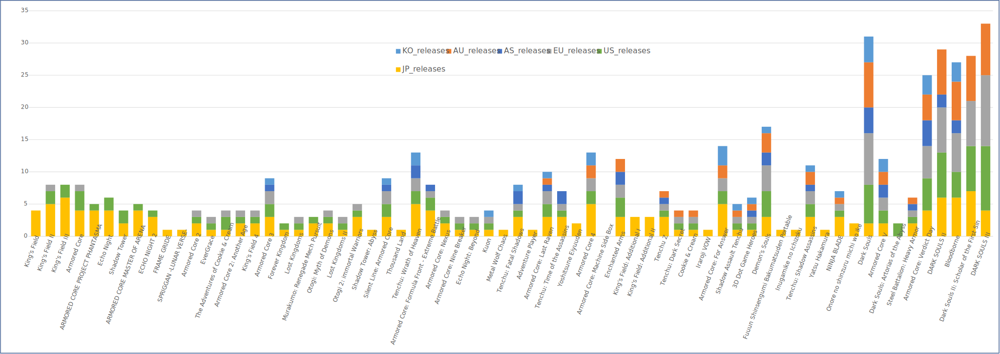
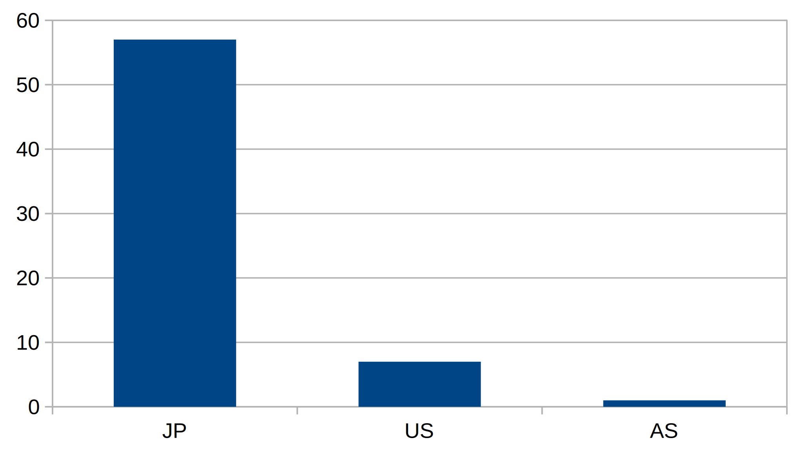
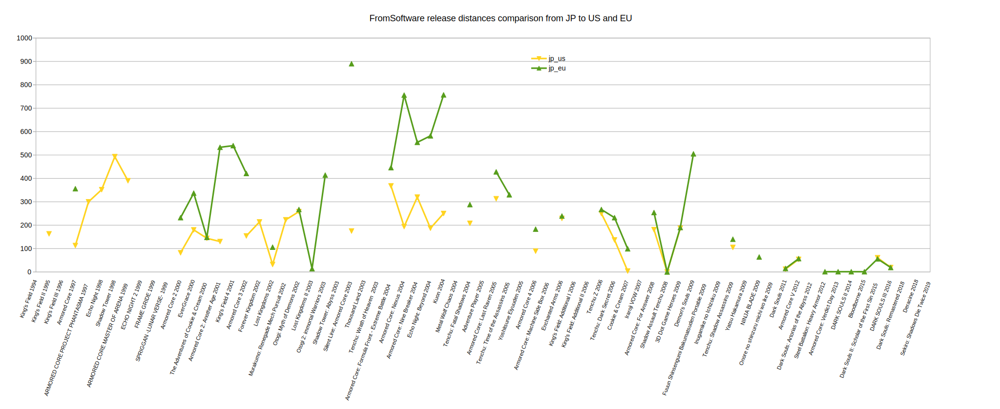

# diggrdata_FromSoftware

This site features the interactive and non-interactive visualizations created based on the datasets about videogames developed and or published by the Japanese company FromSoftware stored in this repository. For more informations, see the [README](README.md)
The data is used in my ongoing research project on videogame spatialization, and will be updated and extended over time. For stable versions used in my research, please refer to the Zenodo upload specified in the respective research output.

## 1. FromSoftware Production

### 1.1. FromSoftware Collaborators per game per country

### 1.2. FromSoftware Production Network based on Mobygames Release Data

Production network of companies involved in FromSoftware games according to the release data on Mobygames.com. Edges are based on contribution to the same game (collaboration network), including a distinction of node for different roles a company might take on, as well as the company location if available via Wikidata. The data was created with [diggr lemongrab](https://github.com/diggr/lemongrab) and edited manually in Gephi 0.9.2 to add statistical data, as well as to include several country data missing on Wikidata and a country based color hex code, following this color schema:

## 2. FromSoftware Distribution

### 2.1. Distribution Overview

### 2.2. Release Timeline

[Interactive Release Timeline](visualizations/fromsoft_release_release_timeline.html)

All available FromSoftware game releases in Japan (JP), Europe (EU) and North America (US) mapped on an interactive timeline with some additional information. The visualization was created with [diggr tulpa](https://github.com/diggr/tulpa). Provenance information is available, added with [diggr provit](https://github.com/diggr/provit).

# Meta

**License**
[CC-BY 4.0](http://creativecommons.org/licenses/by/4.0)

**Copyright**
2021 Martin Roth [research@asobiba.de](mailto: research@asobiba.de)
